# Squadra Experience 2019

Este repositório é um complemento da apresentação que foi feita no evento **Squadra Experience** que aconteceu no dia 14/09/2019.

O objetivo é apresentar um conceito voltado para o gerenciamento de configurações das nossas aplicações de forma segura seguindo uma das boas práticas propostas pelo [The Twelve-factor Factor](http://12factor.net/pt-br).

# Pré-requisitos
- Conta na Azure - [Crie sua conta gratuita](https://azure.microsoft.com/pt-br/free/)
- Visual Studio / Visual Studio Code - [download](http://www.visualstudio.com)
- Docker (Windows / Linux ou MacOs) - [Veja como instalar](https://docs.docker.com/install/)


# O Projeto

Todas as aplicações dependem de configurações como *strings* de conexão, *keys* para SDKs, entre outras configurações. Muitas vezes estas configurações são mantidas em arquivos específicos de cada plataforma de desenvolvimento, **appsettings.json** no caso de uma aplicação desenvolvida em .net core, e fazem parte do artefato compilado. 

Não é uma prática errada. Afinal de contas, manter alguns dados em arquivos de configurações proporciona centralizar as informações em um local comum. No entanto, havendo necessidades de modificar alguma das configurações são necessárias novas compilações e, caso trabalhe com CI/CD pode-se utilizar recursos de transformação de strings e alterar os valores das chaves de acordo com o ambiente. Ainda há uma dependência do processo de compilação. 

Surgem, então, algumas perguntas:
- E como alerar algumas configurações dinamicamente sem subir uma nova versão da aplicação?
- Como manter configurações sensíveis, de forma segura, por ambiente?

De acordo com uma dos princípios mencionadas no **The twelve-factor**:


> [**Configurações**](https://12factor.net/pt_br/config) - Armazene as configurações em um ambiente seguro
> A configuração de uma aplicação é tudo o que é provável variar entre deploys (homologação, produção, ambientes de desenvolvimento, etc)

Para atender a este princípio a utilização de um *Config Server* será necessário.

Com isso, delegamos as configurações para um serviço que irá conter todas as "chaves" da aplicações, separadas por ambiente e mantidas e gerenciadas de forma segura, sem a necessidade do conhecimento por parte da equipe de desenvolvimento. Será muito mais fácil para trabalhar com dados sensíveis. 

O grande propósito deste repositório é a criação de uma aplicação ASP.net Core MVC, bem simples e trabalhando com um config server. A aplicação será desenvolvida e uma imagem docker será gerada para que consigamos simular configurações para ambientes diferentes. Sua funcionalidade básica é o consumo de uma API pública para retorno aleatório de imagens de cachorros. De acordo com o ambiente serão exibidas imagens de cachorros diferentes.

# Aplicação em ASP.NET Core MVC

A aplicação .net core encontra-se criada neste repositório. Abaixo demonstrarei os passos necessários para criar um projeto com o Visual Studio, mas o mesmo projeto pode ser editado no Visual Studio Code.

- Criar novo projeto:

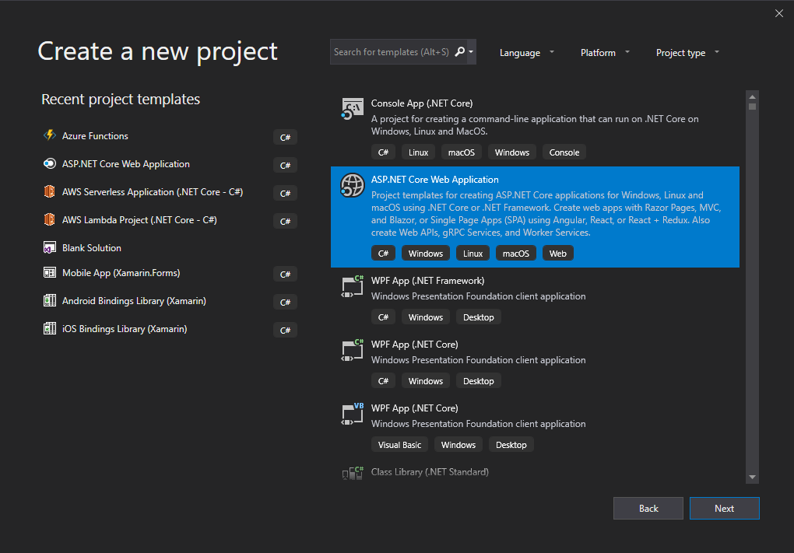

- Definição dos parâmetros:
A imagem abaixo tem uma sugestão de nome do projeto e da *Solution*, além do path para salvar os arquivos.

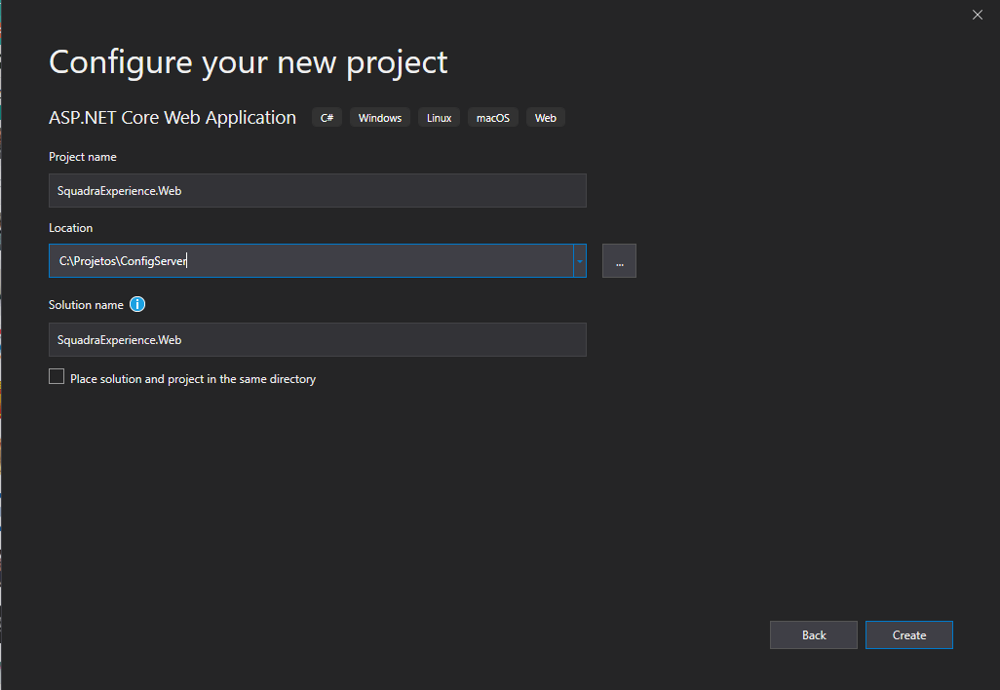

- Selecionar o tipo de projeto:

Selecione o tipo **Web Application (Model-View-Controller) e deixe os demais parâmetros conforme exibido na imagem.

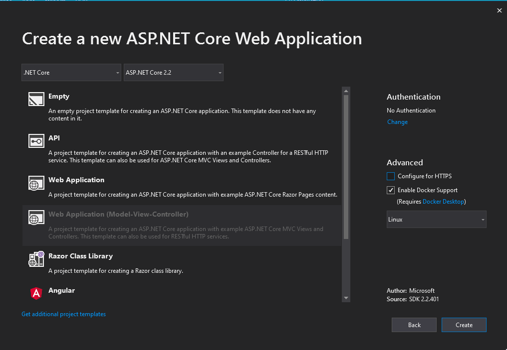

> Estes são os passos para a criação de um novo projeto. Porém vou me basear no projeto contido no presente repositório para explicar a solução.

# Estrutura do Projeto

A estrutura do projeto criado é bem simples, conforme o padrão do ASP.Net MVC.

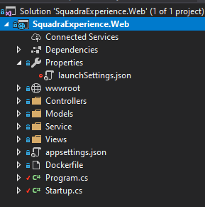

Focaremos nas principais alterações feitas no projeto criado para contemplar o uso do **Azure App Configuration**;

## Instalação de SDKs

> O sdk encontra-se instalado no projeto neste repositório. Os passos abaixo são para explicar ao leitor como proceder caso opte por criar um projeto do zero.

O Azure App Configuration encontra-se em *preview*, portanto sua SDK ainda está em constante alteração. Mesmo assim podemos instalar e utilizar seus recursos.

- No Visual Studio vá em **Tools** -> **Nuget Package Manager** -> **Package Manager Console**.
- Digite o seguinte comando:

```bash
Install-Package Microsoft.Azure.AppConfiguration.AspNetCore -Version 2.0.0-preview-009470001-12
```

Se preferir pela linha de comando, no diretório onde encontra-se o arquivo de projeto da aplicação digite:

```bash
dotnet add package Microsoft.Azure.AppConfiguration.AspNetCore --version 2.0.0-preview-009470001-12
```

## Models

A pasta **Models** vai contar algumas classes que utilizaremos para abstrair configurações e o retorno de um serviço que vamos consumir.

### DogConfiguration.cs

A classe **DogConfiguration.cs** vai abstrair as configurações que desejamos tratar em nossa aplicação como dinâmica:

```csharp

namespace SquadraExperience.Web.Models
{
    public class DogConfiguration
    {
        public string DogName { get; set; }
    }
}


```

Por ser uma aplicação simples, apenas teremos uma propriedade de configuração que irá contar o nome de um cachorro. Este nome será utilizado para obter uma imagem aleatória na API pública.

### DogImageModel.cs

A classe **DogImageModel.cs** representa o modelo de retorno do consumo da API. Ao obter uma imagem aleatória de um cachorro específico, definido pelo nome que virá através das configurações, será retornado um JSON que contém duas propriedades - Status(sucesso ou não) e Message(url da imagem). 

## Service

Com a instalação da Library do **Refit** precisamos, apenas, definir uma interface que irá conter o método e a rota que vamos consumir na api pública para a obtenção de uma imagem aleatória:

### IDogService.cs

```csharp

 public interface IDogService
    {
        [Get("/breed/{dogName}/images/random")]
        Task<DogImageModel> GetRandomImage(string dogName);
    }

```

A configuração é muito simples! Definimos um método chamado **GetRandomImage** que recebe como parâmetro uma string, **dogName**, eretorna um modelo, **DogImageModel**. É bem no padrão de uma interface. Porém a mágica acontece por causa do atributo acimad o método. Este atributo, **Get**, está definido no SDK do **Refit** e necessita de uma string com a rota que será consumida na API. 

Observe na string definida no atributo a existência de um parâmetro **{dogName}**. Este parâmetro será substituído pelo valor que for informado quando o método **GetRandomImage** for chamado.

> Para saber mais sobre o **Refit** consultar a [documentação](https://github.com/jlucansky/refit).

## Controllers

Na criação do projeto já foi definida uma classe **HomeController.cs**. Faremos algumas alterações simples para utilizar as configurações dinâmicas.

```csharp

public class HomeController : Controller
    {
        private readonly IDogService _service;
        private readonly IHostingEnvironment _hosting;
        private DogConfiguration _dogConfig;
       

        public HomeController(IDogService service, IHostingEnvironment hosting, IOptionsSnapshot<DogConfiguration> config)
        {
            _service = service;
            _hosting = hosting;
            _dogConfig = config.Value;
        }

        public async Task<IActionResult> Index()
        {
            var dog = await _service.GetRandomImage(_dogConfig.DogName);
            ViewBag.Dog = _dogConfig.DogName;
            ViewBag.ImageUrl = dog.Message;
            ViewBag.Env = _hosting.EnvironmentName;

            return View();
        }

        // Removi alguns métodos aquin na documentação para facilitar o entendimento. Não será necessário removê-los da controller.
    }

```

Vamos entender as alterações:

- **_service** - Representa a interface para abstrair o consumo da API
- **_hosting** - Representa a interface do .Net Core que contém informações sobre o ambiente. Neste caso, vamos utilizar esta interface para obter o nome do ambiente corrente
- **_dogConfig** - Classe de modelo que vai abstrair as informações obtidas das configurações dinâmicas, vindas do config server.

As propriedades acima precisam ser iniciadas e, portanto, estamos recebendo no construtor da controller suas respectivas instâncias. Elas serão injetadas pela engine do .net core, utilizando o pattern de Injeção de dependência.

> Um ponto de atenção é que um dos paràmetros do construtor é do tipo **IOptionsSnapshot<>**. De forma simples, é uma maneira de obter configurações dinâmicas na aplicação. Para maiores detalhes sobre a utilização deste padrão, favor consultar a [documentação](https://docs.microsoft.com/en-us/aspnet/core/fundamentals/configuration/options?view=aspnetcore-2.2).

- **Index()** - A maior alteração encontra-se neste método. Vamos entender linha a linha:
  - **var dog = await _service.GetRandomImage(_dogConfig.DogName);** - Aqui há o consumo da API pública para recuperar uma imagem aleatória de um cachorro. O nome do cachorro é passado como parâmetro através da classe **_dogConfig** pela propriedade **DogName**. Este valor será configurado posteriormente pelo Azure App Configuration;
  - **ViewBag.Dog = _dogConfig.DogName;** - definimos uma propriedade dinâmica através do **ViewBag** para que a View possa "receber" o nome do cachorro.
  - **ViewBag.ImageUrl = dog.Message** - seguindo o padrão da propriedade anerior, estamos enviando para a view a URL da imagem do cachorro.
  - **ViewBag.Env = _hosting.EnvironmentName;** - neste momento estamos obtendo as informações do ambiente que no caso é o seu nome, e enviamos para a view.

## Views

Faremos duas alterações simples nas Views existentes.

### Views/Home/Index.cshtml

```html
@{
    ViewData["Title"] = "Home Page";
}

    <div class="text-center">
        
        <div class="card mx-auto" style="width: 400px">
            
            <div class="card-body">
                <h5 class="card-title">Dog - @ViewBag.Dog</h5>
                <a class="btn btn-primary" asp-area="" asp-controller="Home" asp-action="Index">Obter Imagem</a>
            </div>
        </div>
        
        
    </div>

```
Apenas preparamos a View principal para conter um card que irá exibir o nome do cachorro, vindo das configurações do servidor, uma imagem aleatória e um botão para carregar uma nova imagem.

Observe o uso do **ViewBag** para recuperação do nome do cachorro e da sua respectiva imagem obtida da API.

### Views/Shared/_Layout.cshtml

```html

<header>
        <nav class="navbar navbar-expand-sm navbar-toggleable-sm text-white navbar-dark border-bottom box-shadow mb-3 ">
            <div class="container">
                <a class="navbar-brand" asp-area="" asp-controller="Home" asp-action="Index">Squadra Experience</a>
                <button class="navbar-toggler" type="button" data-toggle="collapse" data-target=".navbar-collapse" aria-controls="navbarSupportedContent"
                        aria-expanded="false" aria-label="Toggle navigation">
                    <span class="navbar-toggler-icon"></span>
                </button>
                <div class="navbar-collapse collapse d-sm-inline-flex flex-sm-row-reverse">
                    <ul class="navbar-nav flex-grow-1">
                        <li class="nav-item">
                            <a class="nav-link text-white" asp-area="" asp-controller="Home" asp-action="Index">Home</a>
                        </li>
                        <li class="nav-item">
                            <a class="nav-link text-white" asp-area="" asp-controller="Home" asp-action="Privacy">Privacy</a>
                        </li>
                    </ul>
                </div>
                <h1 class="float-right"><span class="badge badge-warning">@ViewBag.Env</span></h1>
            </div>
        </nav>
    </header>

```

Neste arquivo a alteração será feita, apenas, no conteúdo da tag **Header**. Neste ponto adcionamos um título **Squadra Experience** e um *badge* que exibirá em qual ambiente encontra-se a aplicação.

## Startup.cs

Com toda a base do projeto criada e configurada, chegou a hora de adicionar alguma configurações na aplicação para que todo este mecanismo funcione corretamente.

Na classe **startup.cs** terá apenas duas alterações.

### Método ConfigureServices

Adicione as seguintes linhas antes da linha **services.AddMvc()...**:

```csharp

services.Configure<DogConfiguration>(Configuration.GetSection("SquadraExperience:Dog"));
services.AddSingleton(factory =>
            {
                return RestService.For<IDogService>("https://dog.ceo/api");
            });

```
- Em **services.Configure** há a recuperação das configurações do *Config Server* que serão abstraídas na classe **DogConfiguration**.
- Em **services.AddSingleton** adicionamos a instância que será responsável por fazer a requisição na API pública. Observe que um endereço base é passado como parâmetro. Essa é a mágica do Refit. A classe **RestService** é responsável por devolver, a grosso modo, uma instância de uma classe que implementa a interface **IDogService**. Com isso, o construtor da classe **HomeController** vai receber a instância correta para efetuar a requisição no serviço.

### Método Configure App

No método Configure App devemos apenas adicionar uma linha antes de ***app.UseMvc(...)**:

```csharp

app.UseAzureAppConfiguration();

```

Com isso teremos a adição de um **Middleware** que terá a responsabilidadae de atualizar as configurações da aplicação caso haja alguma atualização no config server.

> Para saber mais sobre *Middlewares* no .net core consulte a [documentação](https://docs.microsoft.com/en-us/aspnet/core/fundamentals/middleware/?view=aspnetcore-2.2).

Para esse *extension method** será necessário declarar o *namespace* **Microsoft.AspNetCore.Builder** na sessão *using*:

```csharp

using Microsoft.AspNetCore.Builder;

```

# Azure App Configuration

A base da aplicação encotnra-se configurada. Agora será necessário preparar o *Config Server* e utilizaremos um serviço da Azure.

Um dos serviços do Microsoft Azure disponível, ainda na versão **Preview**, é o Azure App Configuration.

Por estar em preview ainda não há uma camada de preço definida. Contudo, sua documentação e SDKs podem ser alterados constantemente através dos feedbacks dos usuários. Mesmo assim já é possível utilizar tal serviço e já entender como funciona o conceito de centralizar as configurações de sua aplicação.

## Criando um App Configuration

- Acesse o portal da Azure - [https://portal.azure.com](https://portal.azure.com)
- Clique em **Create Resource**:


- Na busca informe **Azure App Configuration** e clique na opção **App Configuration**:

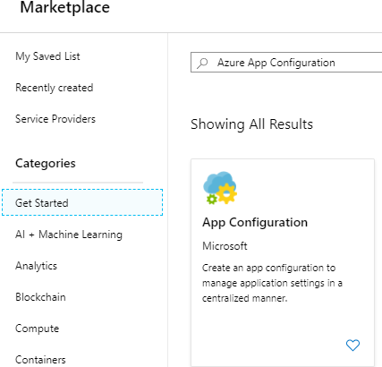

- Na próxima tela clique em **Create**:

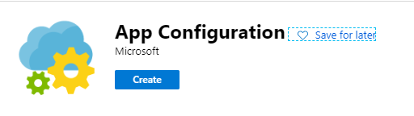


- Neste momento é necessário definir os parâmetros do config server.

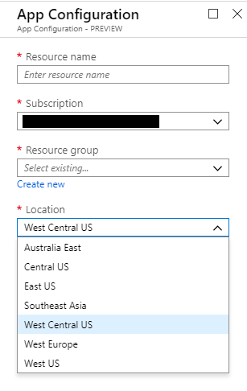

  Defina um nome, subscrição, um resrouce groupe e uma location de sua preferência. Como ainda está em preview, não existem muitas localizações.

- Agora basta clicar em **Create** e aguardar a criação do recurso. 

## Definindo as primeiras configurações

Criado o recurso é hora de criar nossa primeira configuração.

- Acesse o recurso criado anteriormente
- Neste momento, devemos acessar o menu **Configuration Explorer**:

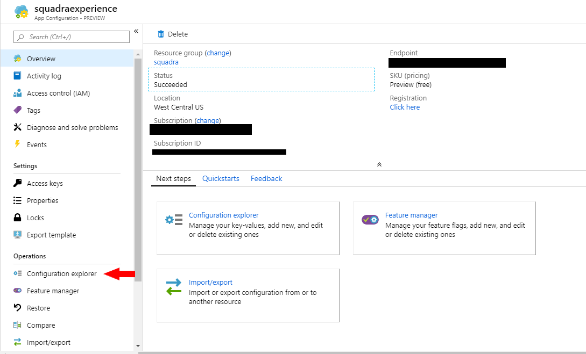

- Clique no botão **Create**

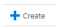

- Serão necessárias três configurações
  - **Ambiente de desenvolvimento**:
    - **Key**: SquadraExperience:Dog:DogName
    - **Value**: akita
    - **Label**: dev
  - **Ambiente de produção**:
    - **Key**: SquadraExperience:Dog:DogName
    - **Value**: chow
    - **Label**: prd
  - **Ambiente de local**:
    - **Key**: SquadraExperience:Dog:DogName
    - **Value**: bouvier
    - **Label**: *Deixe em branco*

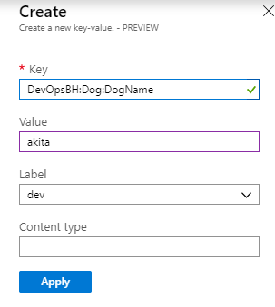

Ao final das configurações você deve ter uma listagem da seguinte forma:

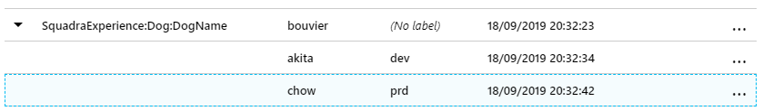

### IMPORTANTE

As aplicações .Net core possuem a características de aceitar o uso de configurações com base em arquivos Json, yml ou através de variáveis ambiente.

No caso do arquivo padrão de configurações, o appsettings.json, teríamos a mesma configuração acima no seguinte formado:

```json
{
    "Dog": {
        "DogName": "bouvier"
    }
}


```

Neste caso, não informei como configurações o **SquadraExperience**. Pode parecer estranho no primeiro momento, mas de acordo com alguns testes que efetuei, o texto **SquadraExperience** funciona como uma espécie de filro na busca das configurações. Sendo assim, todas as configurações desta aplicação deverá possuir como prefixo o valor **SquadraExperience:** para obtenção de uma configuração em "formato de classe".

Por que o formato de classe? Se observar nas configurações na classe **Startup.cs**, obtivemos uma **Section** e abstraímos os seus valores em uma classe "options" denominada **DogConfiguration**. Mas como funcionam as sections e por que o formato de string separado por dois pontos ":"?

Observe o Json decrito anteriormente. Caso você deseje obter o valor da propriedade **DogName** você utiliza uma convenção *Section:Propriedade*, ou *Section__Propriedade*. Neste caso obtém-se o valor. 

```csharp
// Exemplo em um arquivo C# utilizando a interface IConfiguration

...// código abstraído

string dogName = Configuration.GetValue<string>("Dog:DogName"); // recuperando o valor de uma propriedade

```

Mas caso deseje recuperar toda a **Section** e suas respectivas propriedades utiliza-se o nome da section:

```csharp
// Exemplo em um arquivo C# utilizando a interface IConfiguration

...// código abstraído

/*
Neste exemplo estou recuperando o valor do arquivo appsettings.json e
fazendo um "binding" em um objeto, dogConf, que será preenchido de acordo
com a correspondência de nomes de propriedades
*/
DogConfiguration dogConf = new DogConfiguration();
Configuration.GetSection("Dog").Bind(dogConf); 

// outro exemplo


/*
Neste segundo exemplo também recupero os valores de uma section, porém
adicionando um "filtro" com o nome da aplicação para obtenção no App Config na Azure
*/
DogConfiguration dogConf = new DogConfiguration();
Configuration.GetSection("SquadraExperience:Dog").Bind(dogConf); 

```

## Program.cs

Agora será necessário configurar a aplicação para se conectar no App Configuration na Azure. Para isso, no portal da Azure, acesse a opção **Access Key**:

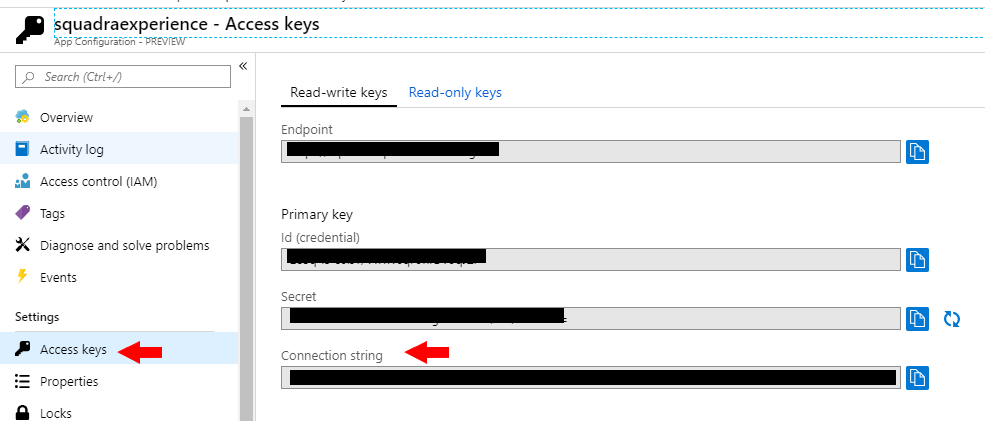

Copie a **connection String**. Ela será necessária para configurar a aplicação.

### Configurando o App Configuration na aplicação

Volte ao código fonte da aplicação e acesse a classe **Program.cs**. Você deve configurá-la da seguinte maneira:

```csharp

using Microsoft.AspNetCore;
using Microsoft.AspNetCore.Hosting;
using Microsoft.Extensions.Configuration;
using Microsoft.Extensions.Configuration.AzureAppConfiguration;
using System;

namespace SquadraExperience.Web
{
    public class Program
    {
        public static void Main(string[] args)
        {
            CreateWebHostBuilder(args).Build().Run();
        }

        public static IWebHostBuilder CreateWebHostBuilder(string[] args) =>
            WebHost.CreateDefaultBuilder(args)
            .ConfigureAppConfiguration((context, config) => {
                IConfigurationRoot settings = config.Build();

                config.AddAzureAppConfiguration(option => { // utilizando o método de extensão para adicionar as configurações do App Configuration
                    option.Connect("SUA CONNECTION STRING") // Conectando em um connection string no recurso da Azure
                        .ConfigureRefresh(refresh => { // Configurando o refresh das configurações
                            refresh.Register("SquadraExperience:Dog:DogName", context.HostingEnvironment.EnvironmentName)
                            .SetCacheExpiration(TimeSpan.FromSeconds(5)); // Determinando que o cache das configurações será de 5 segundos e será analisada a configuração DogName para um determinado ambiente
                        });
                });
            })
                .UseStartup<Startup>();
    }
}

```

Os comentários descrevem bem os passos que serão feitos. Mas de forma simples, através da *connection string* a aplicação vai se conectar ao **App Configuration** na Azure e, além disso, vai monitorar a cada 5 segundos qualquer alteração feita no **DogName** da **Section** **SquadraExperience:Dog**.

Tudo pronto. Agora é só executar e testar.

> A connection string foi utilizada **in-line** para facilitar o exemplo. Porém é uma boa prática mantê-la em uma configuração de **Secrets** para o ambiente de desenvolvimento e utilizar recursos como variáveis de ambiente em seu processo de **continous integration**.

# Execução da aplicação

Com as configurações atuais da aplicação, basta executar (F5) para ver o resultado para o ambiente local:

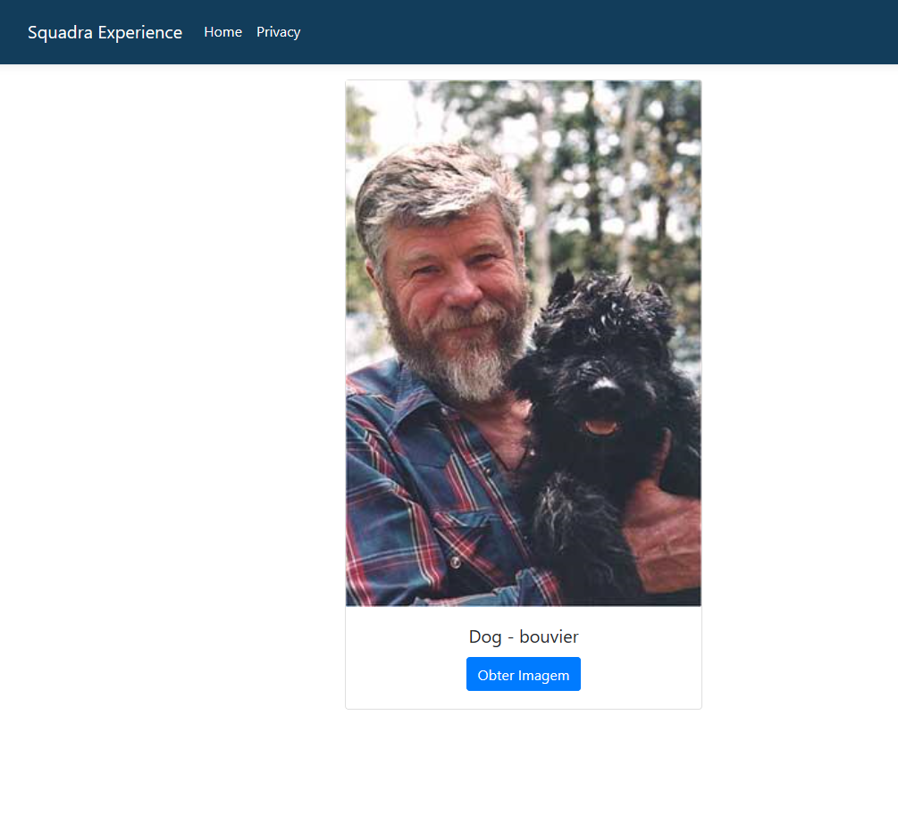

Código funcionado. Porém vamos simular dois ambientes.

## Executando as configurações em ambientes diferentes com o Docker

O primeiro passo é buildar uma imagem docker. Para isso, no fonte da aplicação, neste repositório, encontra-se um arquivo chamado **DockerFile**, na Raiz do projeto **SquadraExperience.Web**. Acesse a raiz do projeto através de um prompt de comando e digite:

```bash

docker build -t dogapp:1.0 .

```

Após a conclusão do comando será criada uma imagem em sua máquina, com o nome de **dogapp:1.0**.

Com a imagem criada, vamos subir dois contâineres, cada um representando um ambiente:

```bash

docker run -dt -p 8080:80 -e ASPNETCORE_ENVIRONMENT=dev dogapp:1.0

```

e

```bash

docker run -dt -p 8181:80 -e ASPNETCORE_ENVIRONMENT=prd dogapp:1.0

```

Os comandos acima parecem idênticos, mas se observar as portas de execução são diferentes **-p 8080:80** e **-p 8181:80**. Além disso, o valor da variável **ASPNETCORE_ENVIRONMENT** é diferente para cada ambiente, representando o valor das **Labels** configuradas no portal da Azure.

A aplicação conseguirá diferenciar as configurações porque no arquivo **Program.cs** solicitamos a manutenção da configuração de acordo com o respectivo ambiente de execução:

```csharp

/*
 Observe o  uso do EnvironmenteName. 
  O valor desta variável é determinado pela variável ambiente ASPNETCORE_ENVIRONMENT
*/
refresh.Register("SquadraExperience:Dog:DogName", context.HostingEnvironment.EnvironmentName)

```

Agora acesse em sua máquina os endereços http://localhost:8080 e http://localhost:8181.

Confira no canto superior direito da apicação um label em amarelo que exibe o ambiente corrente. 

Faça testes clicando nos botões para obtenção das imagens.

Além disso, modifique as configurações para cada ambiente, alterando o valor de **DogName**, no App Config diretamente no portal da Azure. Em seguida, volte na aplicação do respectivo ambiente em que alterou a configuração, atualize a página e pronto!

Para saber quais os nomes de cachorro disponíveis na API acesse: [https://dog.ceo/dog-api/breeds-list](https://dog.ceo/dog-api/breeds-list).


# Conclusão

Esta implementação traz muita flexibilidade já que não há a necessidade de recompilar a aplicação havendo alguma necessidade de mudança em alguma configuração.

O Azure App Configuration ainda encontra-se em preview mas possui muitos outros recursos interessantes, como o uso de **Feature Toggles**.

Para saber mais, acesse: [https://docs.microsoft.com/en-us/azure/azure-app-configuration/](https://docs.microsoft.com/en-us/azure/azure-app-configuration/)